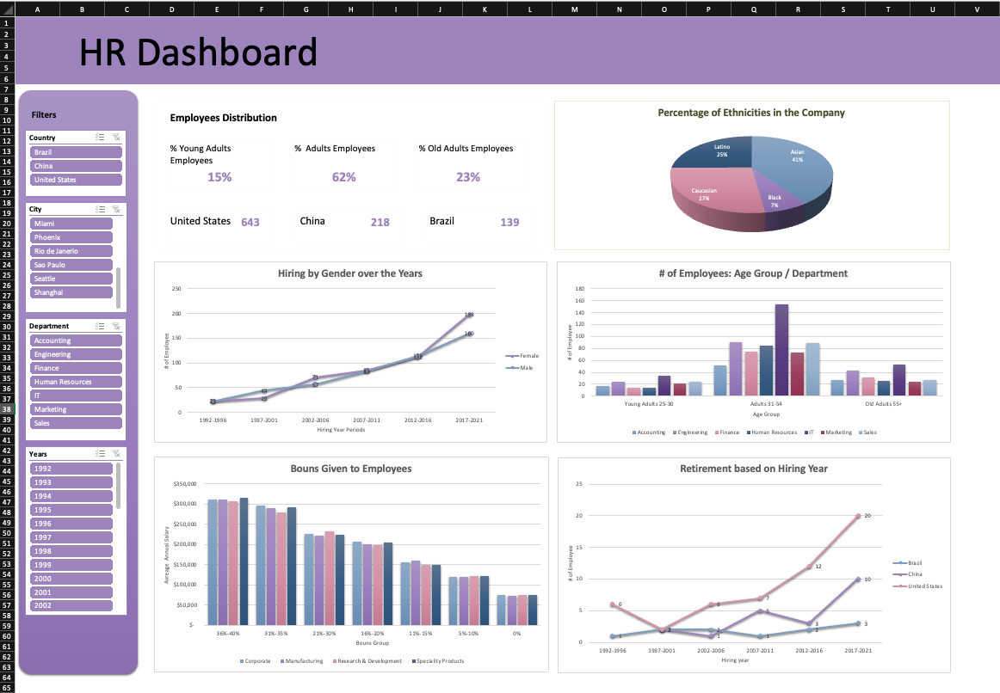

# Data Analysis - HR Dynamic-Dashboard
HR Data analysis dashboard by MS Excel

# Overview
This [dataset](https://www.thespreadsheetguru.com/sample-data/) contains 1,000 rows of data that HR professionals deal with.

Below is a list of all the fields of data:

1. Employee ID
2. Full Name
3. Job Title
4. Gender
5. Ethnicity
6. Age
7. Hire Date
8. Annual Salary (USD)
9. Bonus %
10. Department
11. Business Unit
12. Country
13. City
14. Exit Date

## New Columns
Creating new columns as listed below:
1.  **Age Group** using IF formula
2.  **Hire Year Group**  _5 years each starting in 1992 to 2021_ using IF formula
3.  **Bouns Group** _6 categories_ using IFs formula
4.  **Total Salary** ``` (Annual Salary * Bouns) + Annual Salary```
5.  **Retired** using IF formula

## Calculations
- Total number of employees in each country _using COUNTIF formula_
- The percentage of each group age _using COUNTIF formula_

# Dashboard
In order to create the dashboard I created _5 pivot tables_ to show the following:
1. The employees' retirement over the years based on hiring year
2. The range of bonuses given to the employees in each business unit with the average annual salary
3. The percentage of ethnicities in the company
4. The number of hiring employees based on gender in year periods
5. The distribution of the employees in each department based on age group

In addition, adding filters: 
- Country
- City
- Department
- Year

# Dashboard preview



